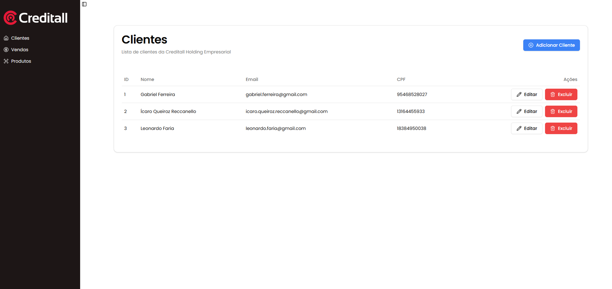
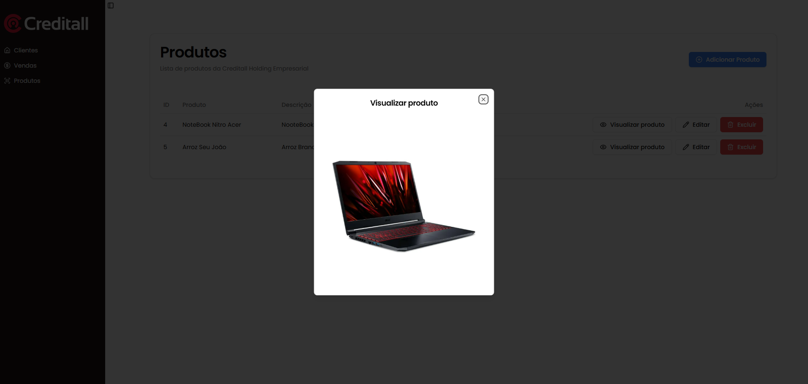
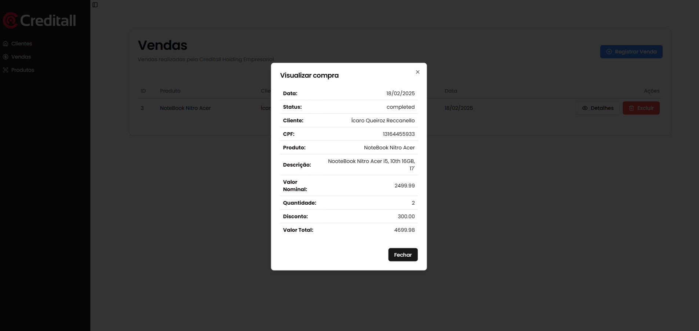

# 📌 Creditall-Challenge

Repositório para a resoluçao do desafio técnico fullstack da creditall-challenge

## 🚀 Tecnologias Utilizadas

- **Frontend**: Next.js + TypeScript + Tailwind CSS + ShadCn
- **Backend**: Node.js + Express + Sequelize + MySQL
- **Banco de Dados**: MySQL
- **Containerização**: Docker + Docker Compose

## 📂 Estrutura do Repositório

```bash
├── frontend/      # Código-fonte do frontend
├── backend/       # Código-fonte do backend
├── docker-compose.yml  # Configuração do Docker Compose
├── .env.example   # Exemplo de arquivo de variáveis de ambiente
└── README.md      # Documentação do projeto

backend/
├── _tests_/        # Testes automatizados do backend
├── src/            # Código-fonte principal
│   ├── config/     # Configurações do projeto
│   ├── controllers/ # Controladores das rotas
│   ├── middlewares/ # Middlewares para requisições
│   ├── models/     # Definição dos modelos do banco de dados
│   ├── routes/     # Definição das rotas da API
│   ├── app.js      # Configuração principal da aplicação
│   ├── server.js   # Inicialização do servidor
├── uploads/        # Diretório para armazenamento de arquivos enviados


```

## ⚙️ Pré-requisitos

Antes de começar, certifique-se de ter instalado em sua máquina:

- [Git](https://git-scm.com/)
- [Docker](https://www.docker.com/)
- [Docker Compose](https://docs.docker.com/compose/)

## 🛠️ Configuração e Execução

### 1️⃣ Clonar o Repositório
```bash
git clone https://github.com/icaroQre/creditall-challenge/new/creditall-challenge
cd creditall-challenge
```
### 2️⃣ Iniciar a Aplicação com Docker

Para subir os containers do frontend, backend e banco de dados, execute:

```bash
docker-compose up --build
```

Caso queira rodar em segundo plano:
```bash
docker-compose up -d --build
```

Aguarde os containers iniciarem e acesse:
- **Frontend**: [http://localhost:3000](http://localhost:3000)
- **Backend**: [http://localhost:8080](http://localhost:8080)
- **Banco de Dados**: Rodando internamente no container

### 4️⃣ Parar os Containers

Para parar e remover os containers:
```bash
docker-compose down
```





